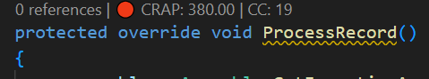
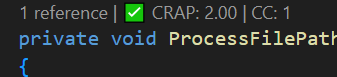

# CRAP Metrics for VS Code

A VS Code extension that shows Cyclomatic Complexity (CC) and CRAP Score directly above your C# methods using CodeLens — helping you quickly identify risky, untested code.

## Features

- 🔍 Inline CodeLens showing `CRAP: X.XX | CC: Y` above every C# method
- ♻️ Refreshes automatically on file save
- ⚡ Powered by a local LSP server using Roslyn for accurate analysis
- 🎯 Quickly identify high-risk methods that need refactoring or tests

## Screenshot





Shows CRAP score and Cyclomatic Complexity directly above C# methods.

## Requirements

- [.NET 8 Runtime](https://dotnet.microsoft.com/download/dotnet/8.0) installed and on PATH
- VS Code 1.85+

## Installation

Install from the [VS Code Marketplace](https://marketplace.visualstudio.com/items?itemName=RamtejDevLabs.vscode-crap-metrics).

## Development Setup

```bash
git clone https://github.com/ramtejsudani/vscode-crap-metrics
cd vscode-crap-metrics

# Build server
cd server/CrapMetricsServer
dotnet build

# Install client dependencies
cd ../../client
npm install
npm run compile

# Package extension
npm run bundle
vsce package
```
Then press `F5` in VS Code to launch the extension in debug mode.

## Project Structure

```
vscode-crap-metrics/
├── client/                  # VS Code extension (TypeScript)
│   ├── src/extension.ts
│   └── package.json
├── server/                  # LSP server (C# / .NET)
│   └── CrapMetricsServer/
│       ├── Analysis/        # CC and CRAP calculators
│       └── Handlers/        # LSP handlers
└── .github/workflows/       # CI/CD pipelines
```
## Understanding the Metrics 

See [complexity.md](server/CrapMetricsServer/complexity.md)

## Contributing

PRs welcome. Please read [CONTRIBUTING.md](CONTRIBUTING.md) before submitting.

## License

MIT
